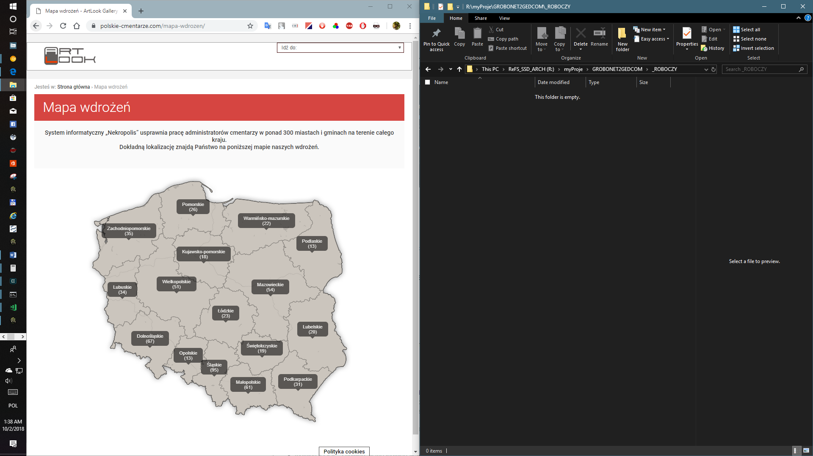
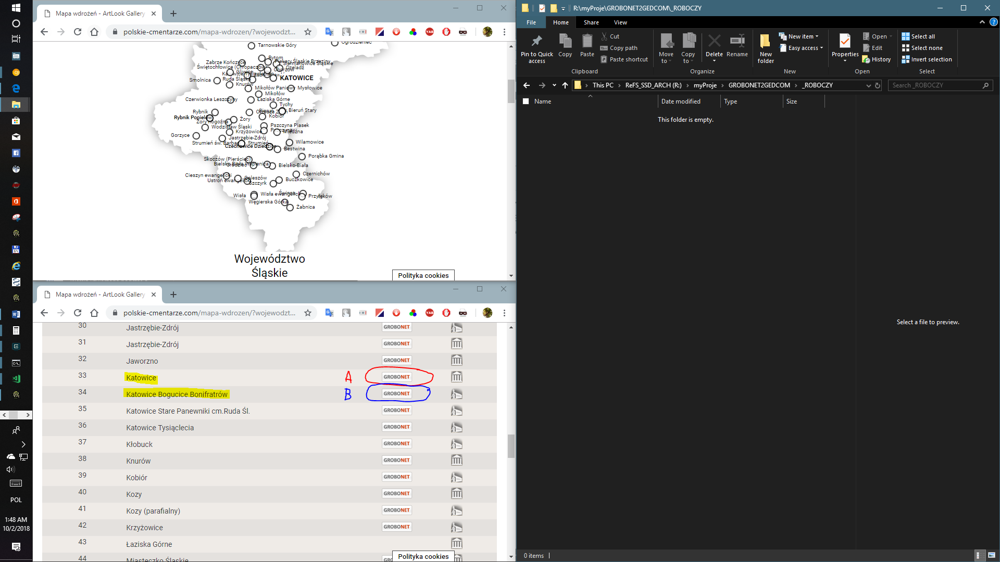
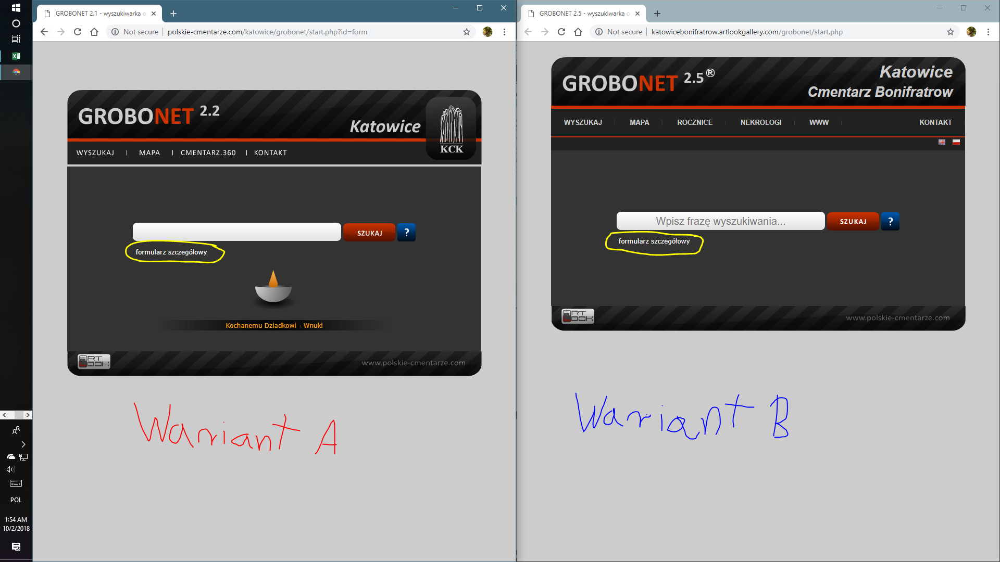
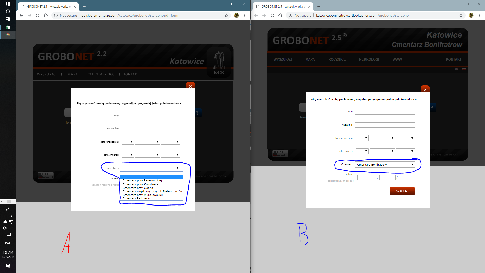
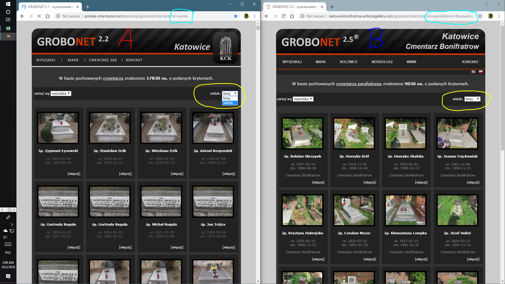
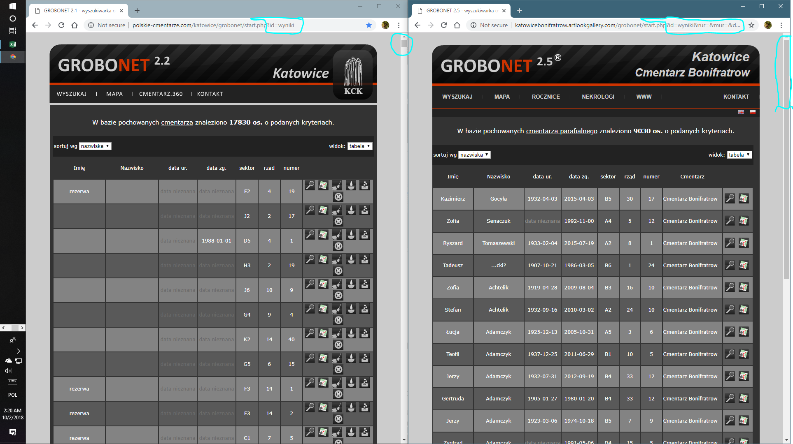
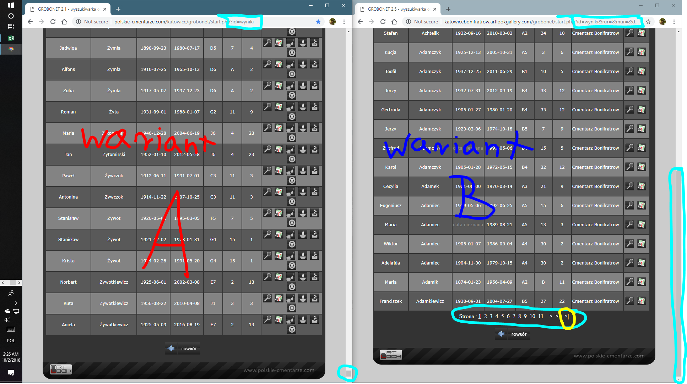
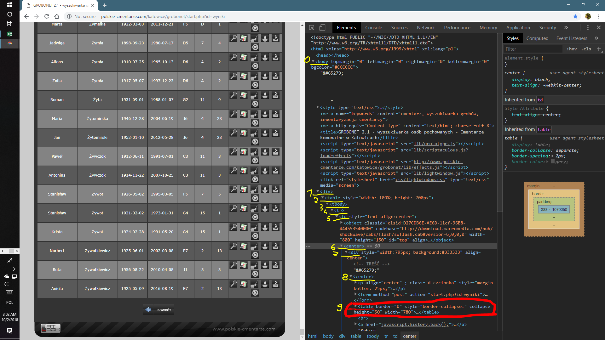
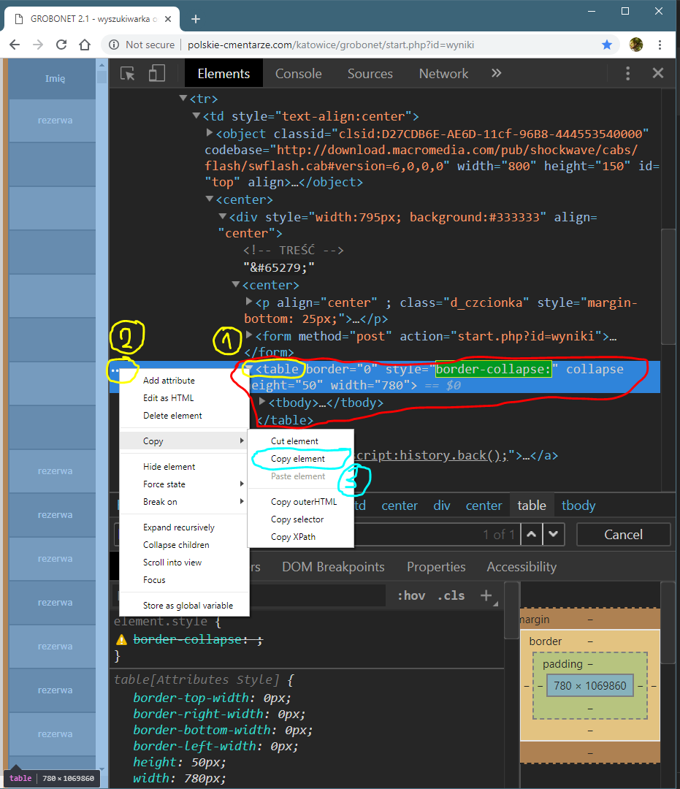

# GROBONET FOR GEDCOM by J.R.Cisowski

## INFORMACJE

1. Program po instalacji zajmuje około 45mb.
2. Obecna wersja działa tylko i wyłącznie na systemie Windows.
3. Program do działania wymaga ekosystemu Node.js, należy go pobrać i zainstalować, przed instalacją programu z strony: [https://nodejs.org/en/download/current/](https://nodejs.org/en/download/current/).
4. Dobrze by było abyś posiadał także przeglądarkę Chrome, gdyż dalsza część dokumentacji, będzie zawierała kroki przygotowywania danych, z użyciem tej przeglądarki, możesz ją pobrać np. z tej strony: [http://www.chromium.org/getting-involved/dev-channel](http://www.chromium.org/getting-involved/dev-channel) (proponuje wersje ‘dev’ lub ‘canary’).
5. Kolejnym narzędziem które Ci się przyda, aby sprawdzić poprawność wygenerowanego pliku Geddom jest „Family Tree Analizer” do pobrania z strony: [http://ftanalyzer.com/install/](http://ftanalyzer.com/install/) Dokumentacja i Opis tego programu jest na stronie [http://ftanalyzer.com](http://ftanalyzer.com)

## INSTALACJA

1. Rozpakuj w dowolnym miejscu na dowolnym dysku plik „GROBONET4GEDCOM.ZIP”
2. Jeśli jeszcze nie zainstalowałeś „NODE.JS” zrób to teraz (jeżeli posiadasz starszy system niż Windows 10, będziesz musiał ponownie uruchomić komputer po instalacji „NODE.JS”, aby Windows poprawnie przetrawił zmienne środowiskowe) Następnie przejdź do rozpakowanego folderu i uruchom plik „_INSTALACJA (uruchom tylko 1 raz).bat” poprzez dwukrotne jego naciśnięcie.

## DOKUMENTACJA

1. W folderze głównym aplikacji jest folder „ _ROBOCZY”, jest to miejsce dla Ciebie, możesz tam dodawać co chcesz, aczkolwiek utworzyłem je w celu ułatwienia przygotowania Tobie importu, wszystkich cmentarzy jakie potrzebujesz.
2. Udaj się teraz do tego folderu „ _ROBOCZY”, oraz otwórz ewidencje dostępnych cmentarzy [https://polskie-cmentarze.com/mapa-wdrozen/](https://polskie-cmentarze.com/mapa-wdrozen/) w oknie Chrome. 

3. Wybierz interesujący Cię cmentarz. UWAGA, jak dotąd odkryłem dwa typy prezentowania danych przez Grobonet, niestety w obydwu musisz postępować różnie, omówię obydwie te metody, oraz metodę rozpoznania która kiedy ma zastosowanie. Nim jednak to pokażę, na kolejnych ilustracjach przedstawię na wszelki wypadek krok po kroku wybór cmentarza. Więc na mapie wybieramy województwo. 

Owe dwa typy omówię na przykładzie Katowic (A i B), kliknij wybrany cmentarz (tym klawiszem który zaznaczyłem w kółeczku i podążaj za dalszymi instrukcjami
4.  
   Kliknij teraz na zaznaczony w kółeczko „formularz szczegółowy”, i tu w zależności, ile dana nekropolia ma pod sobą cmentarzy, może różnić się pewien wybór, (niezależnie od wariantu). 
5. Na grafice, na następnej stronie zaznaczyłem na niebiesko formatkę zatytułowaną „cmentarz” jeżeli jest kilka cmentarzy w niej dostępne należy wybrać ten interesujący nas, a pozostałe okienka zostawić puste* (jeżeli chcesz pobrać dane dla całego cmentarza, oczywiście nic nie stoi na przeszkodzie, abyś wybrał jakiś sektor, lub jakieś imię, lub jakieś nazwisko, ale równie dobrze możesz w Gedcom odfiltrować sobie istotne dla ciebie dane, i ta metodę przynajmniej ja, preferuję. Aczkolwiek dla szczegółowych kwerend, może być przydatne użycie filtrów już tu, jednakże ten skrypt nie radzi sobie z przypadkami gdy w rezultacie otrzymasz mniej niż 2 groby, natomiast w zależności od szybkości komputera i Internetu bez problemu poradzi sobie  nawet z 50 tysiącami grobów :P 
    
   Po wybraniu, cmentarza z listy, kliknij (pomarańczowy) szukaj
6. Tu już pojawia się pierwsza przesłanka z jakim wariantem mamy odczynienie (zaobserwuj fragment adresu strony zaznaczony na lazurowo, w jednym po znaku zapytania, jest krótki tekst, w drugim jakaś długa wiązanka znaków) 
    
   niemniej najpierw kliknij zaznaczone na żółto menu i wybierz z niego widok tabeli (inaczej skrypt nie zadziała)
    
   To co musisz teraz zrobić to przeskrolować stronę do samego końca, w przypadku wariantu „A” jeśli tak jak w powyższym przykładzie cmentarz zawiera dużo grobów, może to trochę ci zająć.. Niemniej i tak musisz to zrobić. :/
7. Zamiast używać scroll, możesz użyć listwy, gdy przewiniesz do dołu, będą się ładować kolejne wersy, tę czynność musisz powtórzyć kilka razy w przypadku wariantu „A”
    
   Zaznaczyłem (od początku, tak też i tu) na kolor lazurowy, wszystkie różnice zauważalne gołym okiem pomiędzy wariantem „A” i „B”, w dalszej części będziesz postępować różnie w zależności z jakim wariantem masz do czynienia, choć litera „A” przypada przed literą „B” zacznę omówienie od „B” gdyż ten model stanowi obecnie przewagę.
8.1. „_ROBOCZY” pierwszy plik tekstowy „metryczka.txt” w notatniku. Napisz sobie tam nazwę jaką chcesz aby twój plik gedcom miał powinna ona wyglądać następująco: 
    >  `Twoja_Dowolna_Nazwa_Dla_Nowego_pliku`

8.2. Kolejną rzeczą będzie krótki opis przeznaczenia, możesz tu np. podać nazwę projektu w którym chcesz użyć tego pliku gedcom, nowy standard gedcom wymaga takiego działania. Może być to krótki opis max 50znaków lub adres twojego projektu np.: 
    > `Projekt Genealogiczny rodzin śląskich`

8.3. Ostatnią istotną dla metryczki gedcom, kwestią jest twój adres email, zostanie on wpisany w wygenerowany gedcom, jako poświadczenie iż jest on wygenerowany przez Ciebie, to także jest wymagane przez nowy standard gedcom. Np.: 
    > `Mój_adres_email@Moja_domena.pl`

9.1. Teraz najlepiej utwórz drugi plik txt o nazwie np. Cmentarze Katowic, a w nim wypisz sobie adresy i nazwy cmentarzy które chcesz importować, aby Gedcom poradził sobie z wyświetleniem cmentarza na mapie, adres musi mieć postać:
    > `ul. Poziomkowa 12, Bogucice, Katowice`

9.2. Natomiast nazwa powinna być opisowa i względnie krótka: 
    > `Katowice-Bogucice (stary)`

9.3. Dobrą praktyką jest ponumerowanie sobie tych cmentarzy i podzielanie na dwie grupy, spełniających wariant „A” i spełniających wariant „B”, 

10. teraz wróćmy do omawiania wariantów dalej.

### Wariant B
Na poprzedniej ilustracji zaznaczyłem na żółto przycisk ostatniej strony, kliknij go, a następnie w pliku tekstowym dla wariantu „B” przy pozycji tego cmentarza, wklej skopiowany adres strony, oraz podaj numer ostatniej strony, powtórz tę czynność dla każdego cmentarza z wariantu „B”

### Wariant A
 
Tu sprawa jest trochę bardziej skomplikowana, dla każdego cmentarza z wariantu „A’ utwórz nowy plik txt, Do którego wkleisz to co poniżej omówię, i w tym miejscu potrzebna jest przeglądarka gogle chrome, jeżeli otwarłeś tę stronę w innej zrób to ponownie tym razem w Google Chrome, jeśli już to zrobiłeś kliknij w dowolnym miejscu na tejże stronie (byle nie na linki, i nie na obrazki) a następnie kliknij na klawiaturze jednocześnie następujące klawisze: [ctrl]+[shift]+[i], możesz też kliknąć myszką w ekran prawym klawiszem i wybrać (jeśli ją posiadasz) opcję „Zbadaj” / „Inspect”, otworzy się takie okienko jak na powyższej grafice.
 Następnie klikając drzewo struktury strony musisz odnaleźć taką pozycję jak zaznaczyłem na czerwono, jeżeli uznamy znacznik `„<body>”` za pozycję bazową „0” to interesujący nas `„<table>”` znajduje się na pozycji głębokości struktury drzewa strony „9” `„<table border=”0” style=”border-collapse:” colapse height……”` jeśli mamy z tym kłopot kliknijmy w dowolnym miejscu w otartym okienku a następnie na klawiaturze kliknij jednocześnie [ctrl]+[f] pojawi się poniżej pozioma formatka w której wpiszmy (bez cudzysłowów, lecz z dwukropkiem na końcu) „border-collapse:” wówczas przeskoczy nam do tego miejsca. Następnie kliknij ten tag (1) `<table…` lewym klawiszem, pojawią się trzy poziome kropki (2) z brzegu kliknij je prawym klawiszem myszy, i z menu rozwijanego wybierz najpierw „Copy” a następnie kliknij lewym klawiszem myszy na „Copy element”, odczekaj kilka sekund, i w uprzednio utworzonym pliku txt, dla tego cmentarza kliknij [ctrl]+[v], lub prawym klawiszem myszy a następnie wklej i zapisz plik. Powtórz tę czynność dla każdego cmentarza z wariantu „A”, pamiętaj aby zapisywać kopiowaną zawartość do oddzielnych plików, dobrą praktyką jest nazywanie tych plików, względem numerów, które obraliśmy w pliku w którym zapisywaliśmy adresy i nazwy cmentarzy wariantu „A”. 

11. Posiadając tak przygotowane dane możemy rozpocząć niemalże automatyczny proces tworzenia gedcom, jedyne co musimy zrobić to postępować zgodnie z instrukcjami pojawiającymi się po uruchomieniu (poprzez kliknięcie dwukrotne lewym klawiszem myszy) pliku „_NOWY_GEDCOM.bat” i z utworzonych w folderze „_ROBOCZY” plików tekstowych kopiowanie i wklejanie do formularza odpowiednich elementów
You can use the [editor on GitHub] 

12. Jeżeli nie pracowałeś jeszcze nigdy z konsolą systemu Windows, to wiec że skopiowany tekst z dowolnego miejsca, wklejamy do konsoli po wstawieniu kursora i naciśnięciu prawego klawisza myszy, a aby zatwierdzić wybór klikamy klawisz [Enter], na końcu działania programu, zamknij okno poprzez naciśniecie dowolnego klawiszu

 13. Następnie otwórz „Family Tree Analyzer” a w nim nowy utworzony plik gedcom, jeśli coś jest nie tak pisz na 4GEN@Cisowscy.com

-------------
### [Dokumentacja dostepna tez w PDF](https://github.com/Cisowscy/grobonet-for-gedcom/blob/master/docs/DOKUMENTACJA.pdf)
-------------